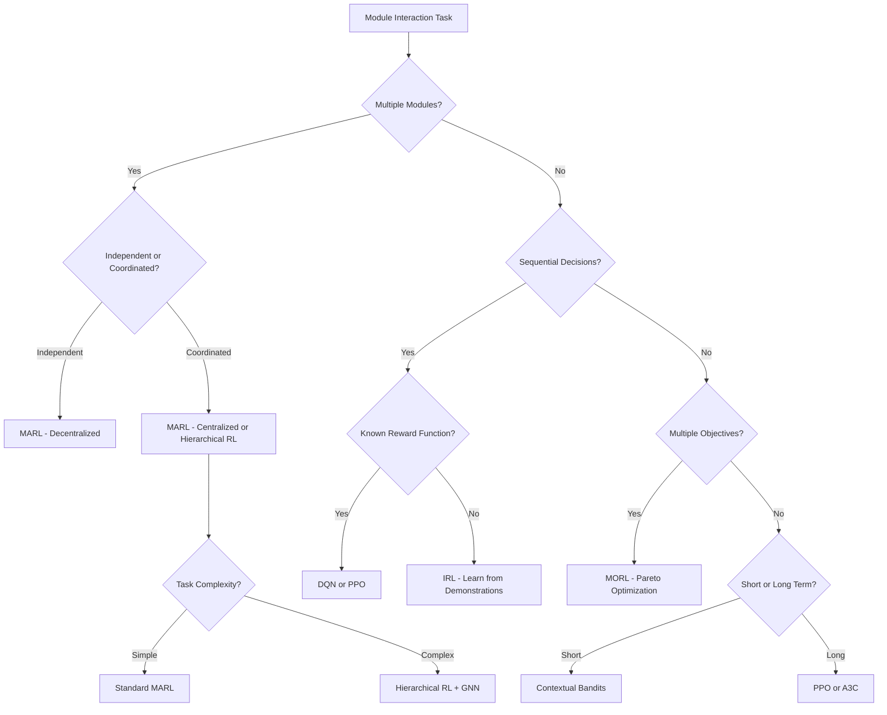

# RL Algorithm Selection Guide for Module Orchestration

## Overview

This guide helps the `claude-module-communicator` select the optimal reinforcement learning algorithm and reward system for different module interaction scenarios. The selection is based on module characteristics, task requirements, and historical performance.

## Algorithm Decision Tree



## Algorithm Characteristics

### 1. **Multi-Agent Reinforcement Learning (MARL)**
- **When to Use**: Multiple modules need to coordinate or compete
- **Strengths**: Scalable, emergent behaviors, decentralized control
- **Best For**: 
  - Distributed data processing pipelines
  - Load balancing across modules
  - Competitive resource allocation
- **Example Scenario**: Coordinating SPARTA, Marker, and ArangoDB for document processing

### 2. **Graph Neural Networks (GNN) Enhanced RL**
- **When to Use**: Module topology matters for decisions
- **Strengths**: Topology-aware, handles dynamic graphs, structural features
- **Best For**:
  - Module dependency management
  - Information flow optimization
  - Dynamic module discovery
- **Example Scenario**: Optimizing data flow through connected modules

### 3. **Hierarchical Reinforcement Learning**
- **When to Use**: Complex multi-step workflows with sub-goals
- **Strengths**: Temporal abstraction, reusable sub-policies, natural decomposition
- **Best For**:
  - Complex orchestration workflows
  - Module composition patterns
  - Long-horizon tasks
- **Example Scenario**: Full pipeline from PDF processing to knowledge graph storage

### 4. **Meta-Learning (MAML)**
- **When to Use**: Need to quickly adapt to new modules
- **Strengths**: Few-shot learning, rapid adaptation, transfer learning
- **Best For**:
  - New module integration
  - Cross-module knowledge transfer
  - Dynamic environments
- **Example Scenario**: Integrating a new data source module

### 5. **Inverse Reinforcement Learning (IRL)**
- **When to Use**: Learning from successful manual orchestrations
- **Strengths**: No explicit reward engineering, learns from demonstrations
- **Best For**:
  - Mimicking expert workflows
  - Preference learning
  - Complex reward scenarios
- **Example Scenario**: Learning optimal workflows from user demonstrations

### 6. **Multi-Objective Reinforcement Learning (MORL)**
- **When to Use**: Balancing multiple competing goals
- **Strengths**: Pareto-optimal solutions, explicit trade-offs, constraint satisfaction
- **Best For**:
  - Cost vs. quality trade-offs
  - Resource optimization
  - SLA compliance
- **Example Scenario**: Balancing speed, accuracy, and cost in LLM provider selection

### 7. **Contextual Bandits**
- **When to Use**: Independent decisions with immediate feedback
- **Strengths**: Simple, fast learning, no temporal dependencies
- **Best For**:
  - Provider/strategy selection
  - A/B testing
  - Short-term optimization
- **Example Scenario**: Selecting the best LLM provider for each request

### 8. **Deep Q-Networks (DQN)**
- **When to Use**: Discrete action spaces with sequential decisions
- **Strengths**: Off-policy learning, experience replay, stable
- **Best For**:
  - Strategy selection
  - Discrete optimization
  - Fixed action sets
- **Example Scenario**: Choosing processing strategies in Marker

### 9. **Proximal Policy Optimization (PPO)**
- **When to Use**: Continuous control or stable learning needed
- **Strengths**: Stable training, continuous actions, robust
- **Best For**:
  - Parameter tuning
  - Continuous optimization
  - Safety-critical applications
- **Example Scenario**: Optimizing ArangoDB query parameters

### 10. **Asynchronous Advantage Actor-Critic (A3C)**
- **When to Use**: Need parallel exploration
- **Strengths**: Fast training, parallel workers, good exploration
- **Best For**:
  - Large action spaces
  - Exploration-heavy tasks
  - Multi-core utilization
- **Example Scenario**: Exploring different module configurations in parallel

## Module Characteristic Analysis

### Feature Extraction for Algorithm Selection

```python
def analyze_module_characteristics(module_info):
    """Extract features to guide algorithm selection"""
    return {
        # Structural features
        'num_modules': len(module_info['modules']),
        'connectivity': calculate_graph_density(module_info['connections']),
        'has_cycles': detect_cycles(module_info['connections']),
        
        # Temporal features
        'avg_latency': module_info['performance']['avg_latency'],
        'requires_sequential': module_info['constraints']['sequential'],
        'time_horizon': module_info['constraints']['max_steps'],
        
        # Objective features
        'num_objectives': len(module_info['objectives']),
        'has_constraints': bool(module_info['constraints']),
        'reward_known': module_info['reward_function'] is not None,
        
        # Complexity features
        'action_space_size': calculate_action_space(module_info),
        'state_space_continuous': module_info['state']['continuous'],
        'stochastic_env': module_info['environment']['stochastic'],
        
        # Learning features
        'has_demonstrations': bool(module_info['expert_trajectories']),
        'online_learning': module_info['requirements']['online'],
        'safety_critical': module_info['requirements']['safety_critical']
    }
```

## Reward System Design

### 1. **Single-Objective Rewards**
```python
class SimpleReward:
    def calculate(self, state, action, next_state, info):
        # For tasks with clear single objective
        success = info['task_completed']
        time_penalty = -0.01 * info['execution_time']
        return float(success) + time_penalty
```

### 2. **Multi-Objective Rewards**
```python
class MultiObjectiveReward:
    def __init__(self, weights):
        self.weights = weights  # e.g., {'quality': 0.4, 'speed': 0.3, 'cost': 0.3}
    
    def calculate(self, state, action, next_state, info):
        components = {
            'quality': info['output_quality'],
            'speed': 1.0 / (1.0 + info['latency']),
            'cost': -info['computational_cost']
        }
        return sum(self.weights[k] * v for k, v in components.items())
```

### 3. **Hierarchical Rewards**
```python
class HierarchicalReward:
    def calculate_meta_reward(self, option_completed, final_goal_progress):
        # Reward for high-level decisions
        return option_completed * 0.1 + final_goal_progress
    
    def calculate_option_reward(self, step_progress, efficiency):
        # Reward for low-level actions within an option
        return step_progress * 0.01 - efficiency * 0.001
```

### 4. **Learned Rewards (IRL)**
```python
class LearnedReward:
    def __init__(self, feature_weights):
        self.weights = feature_weights  # Learned from demonstrations
    
    def calculate(self, state, action, next_state, info):
        features = extract_features(state, action, next_state)
        return np.dot(self.weights, features)
```

## Integration with Claude-Module-Communicator

### Automatic Algorithm Selection

```python
from rl_commons.core.algorithm_selector import AlgorithmSelector
from rl_commons import ALGORITHM_REGISTRY

class ModuleCommunicatorRL:
    def __init__(self):
        self.selector = AlgorithmSelector()
        self.active_algorithms = {}
    
    def select_algorithm(self, task_spec):
        """Automatically select best RL algorithm for task"""
        # Extract task characteristics
        features = analyze_module_characteristics(task_spec)
        
        # Get algorithm recommendation
        algorithm_name, confidence = self.selector.recommend(features)
        
        # Initialize selected algorithm
        algorithm_class = ALGORITHM_REGISTRY[algorithm_name]
        algorithm = algorithm_class(task_spec['config'])
        
        # Store for reuse
        task_id = task_spec['id']
        self.active_algorithms[task_id] = {
            'algorithm': algorithm,
            'name': algorithm_name,
            'confidence': confidence,
            'features': features
        }
        
        return algorithm
    
    def execute_task(self, task_spec):
        """Execute task with appropriate RL algorithm"""
        # Select algorithm if not already selected
        if task_spec['id'] not in self.active_algorithms:
            algorithm = self.select_algorithm(task_spec)
        else:
            algorithm = self.active_algorithms[task_spec['id']]['algorithm']
        
        # Execute with selected algorithm
        state = self.get_current_state(task_spec)
        action = algorithm.select_action(state)
        
        # Execute action and observe outcome
        next_state, reward, done, info = self.execute_action(action)
        
        # Update algorithm
        algorithm.update(state, action, reward, next_state, done)
        
        return {
            'action': action,
            'reward': reward,
            'algorithm_used': self.active_algorithms[task_spec['id']]['name'],
            'performance': info
        }
```

### Performance-Based Adaptation

```python
class AdaptiveAlgorithmSelector:
    def __init__(self):
        self.performance_history = defaultdict(list)
        self.algorithm_scores = defaultdict(float)
    
    def update_performance(self, task_features, algorithm_name, performance):
        """Track algorithm performance for different task types"""
        task_type = self.categorize_task(task_features)
        self.performance_history[task_type].append({
            'algorithm': algorithm_name,
            'performance': performance,
            'timestamp': time.time()
        })
        
        # Update rolling average scores
        self.update_scores(task_type)
    
    def recommend_with_history(self, task_features):
        """Recommend based on historical performance"""
        task_type = self.categorize_task(task_features)
        
        if task_type in self.algorithm_scores:
            # Use historical performance
            scores = self.algorithm_scores[task_type]
            best_algorithm = max(scores, key=scores.get)
            confidence = scores[best_algorithm]
        else:
            # Fall back to feature-based selection
            best_algorithm, confidence = self.feature_based_recommendation(task_features)
        
        return best_algorithm, confidence
```

## Best Practices

### 1. **Start Simple**
- Begin with Contextual Bandits or DQN for simple tasks
- Add complexity only when needed
- Measure baseline performance first

### 2. **Monitor and Adapt**
- Track algorithm performance continuously
- Switch algorithms based on performance degradation
- Use ensemble methods for robustness

### 3. **Safety First**
- Always implement fallback strategies
- Use gradual rollout for new algorithms
- Monitor for unexpected behaviors

### 4. **Reward Engineering**
- Start with simple, interpretable rewards
- Use IRL when reward design is complex
- Validate rewards align with business objectives

### 5. **Scalability Considerations**
- Use MARL for truly distributed scenarios
- Consider computational costs in algorithm selection
- Implement caching for repeated decisions

## Example Use Cases

### 1. **Document Processing Pipeline**
- **Modules**: Marker (PDF processing) → Claude Max Proxy (LLM) → ArangoDB (storage)
- **Algorithm**: Hierarchical RL with PPO for parameter optimization
- **Reward**: Multi-objective (quality + speed + cost)

### 2. **LLM Provider Selection**
- **Modules**: Claude Max Proxy with multiple providers
- **Algorithm**: Contextual Bandits
- **Reward**: Weighted combination of latency, cost, and quality

### 3. **Distributed Data Analysis**
- **Modules**: Multiple SPARTA instances + YouTube Transcripts
- **Algorithm**: MARL with GNN for topology awareness
- **Reward**: Load balancing + throughput

### 4. **Adaptive Module Discovery**
- **Modules**: Dynamic set of available modules
- **Algorithm**: Meta-Learning (MAML) for quick adaptation
- **Reward**: Task completion success rate

## Monitoring and Debugging

### Key Metrics to Track

1. **Algorithm Performance**
   - Average reward per algorithm
   - Convergence speed
   - Stability (variance of rewards)

2. **Task Success**
   - Completion rate by algorithm
   - Time to completion
   - Resource usage

3. **Adaptation Quality**
   - Algorithm switching frequency
   - Performance after switches
   - Learning curve steepness

### Debugging Common Issues

1. **Poor Performance**
   - Check feature extraction quality
   - Verify reward function alignment
   - Consider algorithm hyperparameter tuning

2. **Instability**
   - Reduce learning rate
   - Increase exploration gradually
   - Check for reward scale issues

3. **Slow Learning**
   - Consider using demonstrations (IRL)
   - Implement curriculum learning
   - Use transfer learning from similar tasks

## Conclusion

The key to successful RL integration with the claude-module-communicator is:

1. **Accurate task characterization** through feature extraction
2. **Appropriate algorithm selection** based on task requirements
3. **Continuous monitoring and adaptation** based on performance
4. **Safety mechanisms** to ensure reliable operation

By following this guide, the module communicator can intelligently select and apply the most appropriate RL techniques for any given module orchestration challenge.